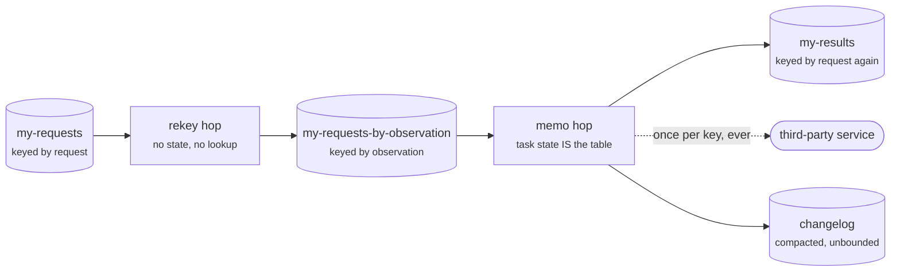

# Config Topics — Shared Lookup Tables

A stage declares two kinds of topics. `input_topics` (transformers only) are partitioned: their records drive `transform()` and define the task model. `config_topics` are read **in full by every instance** into one per-process `ConfigStore` keyed by wire key — Kafka Streams' GlobalKTable, specialized to configuration:

```python
from collections.abc import AsyncIterator

from flechtwerk import Extractor, IncomingMessage, Message, State, Transformer

class MyExtractor(Extractor):
    config_topics = ["my-config"]          # an extractor's inputs ARE config topics
    ...                                    # plus your poll()

class RequestDriven(Transformer):
    input_topics = ["my-requests"]         # partitioned, keyed stream
    config_topics = ["my-config"]          # config table, joined by key

    async def transform(self, msg: IncomingMessage, state: State) -> AsyncIterator[Message | State]:
        config = self.configs.get(msg.key)  # eventually consistent lookup
        if config is None:
            return                          # no config for this key (yet)
        yield Message(key=msg.key, topic="my-results", value=msg.value)

stage = RequestDriven()
```

For extractors this is not an extra mechanism but the baseline: config topics are the only Kafka input an extractor has. For transformers it is the escape hatch from the co-partitioning requirement: a config topic's partition placement and count are irrelevant, so any producer (Kafka UI included) can write configs without routing them to the "right" partition. One refinement for an [extractor](../guides/extractor.md#scaling-out): its config topics must share one partition *count* (the partitions double as the ownership leases that shard configs across replicas), but *placement* stays irrelevant even there — ownership is a consumer-side hash of the state key, never the record's partition.

The source topics are their own changelog — compacted, small, re-read on every startup — and lookups are eventually consistent, outside the task transaction (the GlobalKTable caveat). A stage can also *maintain* a config topic instead of only reading one — see [Writing to a Config Topic](#writing-to-a-config-topic).

## Enrichment on the Way In

`Stage.enrich_config(config)` hooks one-time derivation (e.g. an API lookup) into the config path: the framework applies it **once per config record** — never per poll tick or lookup — and both stage kinds inherit it.

!!! note "Why Re-Reading Is Safe"

    Kafka Streams forbids transforming records on their way into a global store (KIP-813) because a checkpoint-based restore would bypass the transformation. Flechtwerk re-reads the topics through the same `enrich_config` path on every startup, so the enriched store cannot diverge.

## When a Config Record Won't Decode

Config records are usually written by hand or by ops tooling, which is exactly where a bad one comes from: a stray array, a Latin-1 key, a half-written value. Decoding is strict, and the policy is [`Stage.on_invalid_message`](invalid-messages.md) — by default it crashes the stage, at startup during the bootstrap or in the main loop during a drain. That is deliberate for a table every instance depends on: a config that silently read as `{}` would look like a missing key at the lookup site, far from the record that caused it.

The same determinism argument as above applies to the hook itself: every boot re-reads the topics through it, so a handler whose substitution varies would build a store that diverges from what a fresh boot builds.

## Writing to a Config Topic

Config topics are usually written by someone else — a team, ops tooling, a UI. A stage may also **maintain** one: declare it, then yield a `Message` whose topic is that config topic. The use case is a durable memo of an *external observation* — a third-party answer that is timestamped rather than derived from your own data, so recomputing it later asks a different question. Record it once and read it back forever, including across a full reprocess.

```python
from collections import OrderedDict
from collections.abc import AsyncIterator

from flechtwerk import Event, IncomingMessage, Message, State, Transformer

class Memoizing(Transformer):
    input_topics = ["my-requests"]
    config_topics = ["my-observations"]

    def __init__(self, cache_size: int = 10_000):
        # Bridges the gap between producing a row and seeing it through
        # `configs.get` after the next drain. Bounded, and safe to lose.
        self.recent: OrderedDict[str, dict] = OrderedDict()
        self.cache_size = cache_size

    async def transform(self, msg: IncomingMessage, state: State) -> AsyncIterator[Message | State]:
        key = observation_key(msg.value)
        row = self.recent.get(key)
        if row is None:
            config = self.configs.get(key)
            row = None if config is None else config.raw
        if row is None:
            row = await ask_third_party(key)
            # The topic is the write path — `ConfigStore` is read-only here.
            yield Message(key=key, topic="my-observations", value=Event.wrap(row))
        self.remember(key, row)
        yield Message(key=msg.key, topic="my-results", value=enrich(msg.value, row))

    def remember(self, key: str, row: dict) -> None:
        self.recent[key] = row
        self.recent.move_to_end(key)
        while len(self.recent) > self.cache_size:
            self.recent.popitem(last=False)
```

The write rides the task transaction like any other output — the runner does not care which topic a yielded `Message` names — so the new row, the output derived from it, and the input offsets commit atomically. And because the config consumer runs `read_committed`, an aborted transaction's row never reaches any instance's store.

!!! warning "What a Stage-Maintained Table Must Not Assume"

    - **No read-your-writes.** `configs.get(...)` cannot see the row until the next drain, the next loop iteration at the earliest — hence the bridge above. Keep it **bounded** (the store holds wire bytes and re-decodes per `get`, so an unbounded parsed shadow of it is a memory leak) and keep every entry **safe to lose**: an eviction or a crash must degrade to "resolve it again and emit an identical row", never to a silently skipped write. In a transformer that is enough, because a bridge entry cannot outlive the write it recorded: an aborted transaction takes the process, and the bridge with it. An extractor is different — a poll cancelled at a token handover aborts its page while the runner keeps going, so an entry there can survive a write that never landed. On that path let the bridge save the external *call*, never the *write*: emit the row whenever `configs.get` still misses, which costs one duplicate record — the rows are idempotent and compaction is last-write-wins.
    - **Writes are not serialized.** Two instances — or two state-key buckets of one batch — can resolve the same brand-new key concurrently and both emit. Compaction makes that last-write-wins, so rows must be idempotent and order-insensitive. No counters, no read-modify-write: that needs partitioned task [state](exactly-once.md), not a config topic.
    - **The `ConfigStore` is not a write path.** Its `_put`/`_delete` are internal to the config machinery; a stage-side write never reaches Kafka, corrupts one instance, and is reverted by the next record for that key or the next restart.
    - **The size contract still binds.** The whole table lives in RAM per instance and is re-read in full on every boot — Flechtwerk's store is a plain dict of wire bytes, not Kafka Streams' RocksDB-materialized, checkpointed GlobalKTable. A key space that grows without bound outgrows this: see [Graduating to a Repartition Hop](#graduating-to-a-repartition-hop), and watch `config_store_bytes` on the way there.
    - **The topic is not reproducible.** Unlike team-managed configuration, it is the sole copy of observations nothing can recompute: compact it, retain it forever, and keep reset tooling away from it.

## Graduating to a Repartition Hop

A table people maintain plateaus at the number of things they configured; one that a stage maintains itself grows with the data, so it can outgrow the mechanism. What forces the move is **structural**, never a byte count — any one of these:

- **The key space grows with data volume** rather than with configuration. Every instance holds the whole table in RAM and re-reads it in full on every boot, so an unbounded key space leaves neither memory nor startup time bounded.
- **Writes need serializing** — a counter, a running set, anything read-modify-write. Compaction gives last-write-wins, which is not a merge, and two instances resolving the same key concurrently is normal here.
- **Read-your-writes is required** rather than merely convenient, so a bridge across the drain gap is not enough.

For scale, here is one measured point — an illustration of the cost *shape*, not a supported ceiling. A store of 1 000 000 entries with 20-character keys and ~200-byte values (CPython 3.14, arm64) weighs 191 MiB on the wire, occupies 337 MiB of RSS, and costs about 6 s of CPU to apply. A startup bootstrap peaks near 755 MiB because it retains every surviving record before applying any of them — so a table that *fits* can still fail to *boot*. Scale from your own value size: RSS came out a little under twice the wire size, and the boot peak a little over twice the RSS. The same shape at 100 000 entries is 19 MiB on the wire and 35 MiB of RSS, which is unremarkable.

The exit is the one the [co-partitioning rule](exactly-once.md#constraints) already prescribes for any mid-pipeline key change: an explicit intermediate topic keyed by the observation key, then a second transformer whose **task state** holds the memo.



```python
from collections.abc import AsyncIterator

from flechtwerk import Event, IncomingMessage, Message, State, Transformer
from flechtwerk.attribute import ANY, Attribute, STR

REQUEST_KEY = Attribute("request_key", STR)  # the key the repartition replaced
ROW = Attribute("row", ANY)                  # the observation, as the service gave it


class Rekey(Transformer):
    """Hop 1 — a key change and nothing else: no state, no lookups, no external calls."""

    input_topics = ["my-requests"]

    async def transform(self, msg: IncomingMessage, state: State) -> AsyncIterator[Message | State]:
        request = Event(msg.value)      # a copy — the original key travels in the value
        request[REQUEST_KEY] = msg.key
        yield Message(key=observation_key(msg.value),
                      topic="my-requests-by-observation", value=request)


class Memo(Transformer):
    """Hop 2 — the observation table IS this task's state, keyed by the observation."""

    input_topics = ["my-requests-by-observation"]

    async def transform(self, msg: IncomingMessage, state: State) -> AsyncIterator[Message | State]:
        row = state.get(ROW)
        if row is None:
            row = await ask_third_party(msg.key)   # msg.key IS the observation key now
            yield State({ROW: row})                # rides this batch's transaction
        yield Message(key=msg.value[REQUEST_KEY], topic="my-results",
                      value=enrich(msg.value, row))
```

No `configs`, no bridge, no `enrich_config`. The default `extract_state_key` is the message key, which the repartition just made the observation key, so `state` *is* the memo for this observation — and the last two criteria above stop applying:

- **Read-your-writes is immediate.** Records sharing a state key run serially within a batch, each seeing the previous one's yielded `State`, so two requests for one brand-new observation in the same batch ask the service once. That is what the `OrderedDict` bridge was imitating.
- **Writes are serialized.** One task owns the key, fenced by its static transactional ID, so read-modify-write is legal here: counters, running sets, a merge instead of last-write-wins.
- **Size stops mattering.** The memo is a RocksDB store with a compacted changelog, restored per partition on assignment. Nothing holds the whole table in RAM and nothing re-reads it in full at boot.

What you give up is real, so weigh it: an extra topic and hop (one more transaction boundary, and its latency), the original key has to travel in the value because the repartition replaced it, the [size ceiling moves](exactly-once.md#constraints) from the table to the individual record (one `State` is one changelog record, capped near 1 MiB), and the table stops being globally readable — a task answers only for the partitions it owns, which is precisely what a config topic was buying. The hop's input partition count is also frozen once its state exists.

!!! note "Why the Store Is Not RocksDB-Backed"

    Kafka Streams materializes a GlobalKTable into RocksDB with a checkpoint, so a restart resumes from the checkpointed offset. Flechtwerk's pods are ephemeral and hold no persistent volume, so every boot reads the topic in full whatever the store is made of — RocksDB would only move the bytes onto a disk that dies with the pod, and put an LSM read in the path of every lookup. The checkpoint is the part that would pay off, and it is exactly what the [enrichment contract](#enrichment-on-the-way-in) rules out: a restore that skipped `enrich_config` is the divergence KIP-813 forbids. The framework does have a RocksDB store with a changelog and no size contract — it is task state, and the hop above is how you reach it.
