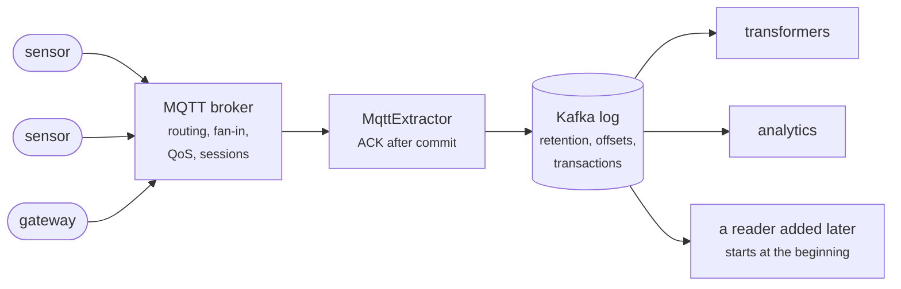
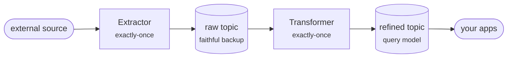
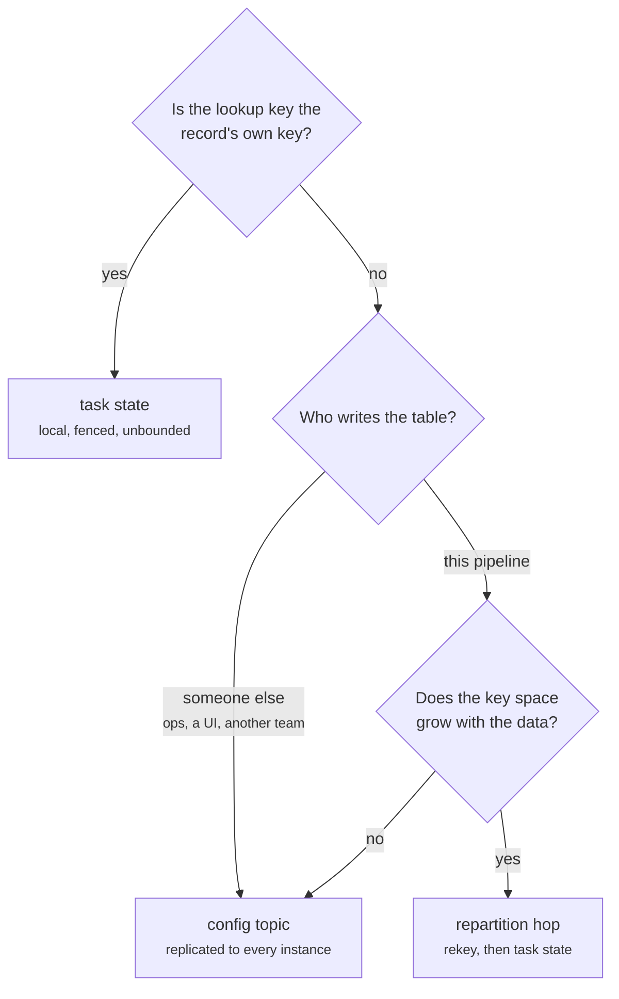
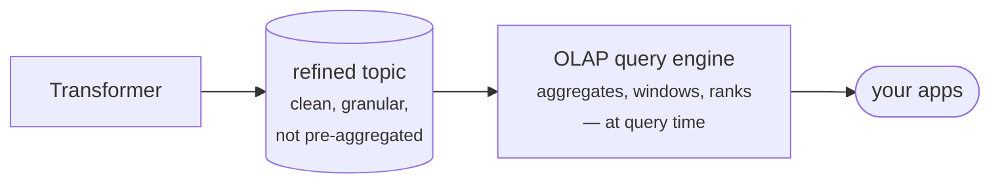

# Best Practices

## Let MQTT Route and Kafka Remember

Two pieces of infrastructure in a push-driven pipeline carry messages by topic
from many producers to many consumers, and from a distance they look
interchangeable. They are not, and the division of labour between them is the
first design decision worth getting right: **MQTT for distribution and routing,
Kafka for persistence and replayability.**

- **MQTT owns the last mile.** Thousands of intermittently connected publishers,
  wildcard filters that route by topic with no registry to maintain, QoS and a
  persistent session that survive a link dropping mid-message. What it does not
  own is memory: an MQTT broker hands each message to whoever is subscribed
  *now*, and what it holds for an absent subscriber is a bounded queue, not a
  history.
- **Kafka owns the history.** An append-only log where retention is a policy you
  set rather than a side effect of who happened to be listening, and where the
  read position belongs to the **consumer** — any number of readers consume the
  same records independently, at their own pace, and one added a year from now
  still starts at the beginning. Every guarantee the rest of this page leans on
  (replay, exactly-once, reprocessing without re-ingesting) is a property of that
  log, and none of them can be built on a transport that forgets.
- **The bridge between them stays narrow.** An [`MqttExtractor`](mqtt.md)
  subscribes, relays each payload, and ACKs the MQTT broker only once the Kafka
  transaction carrying it has committed — nothing leaves the MQTT session until
  Kafka owns it. Keep that hop boring: no enrichment, no aggregation, no
  filtering you might regret, because it is the one hop you cannot replay.

!!! warning "An MQTT Session Is a Delivery Window, Not a Safety Net"

    Persistent sessions and QoS 1 read like durability, which makes it tempting
    to treat the MQTT broker as a buffer the bridge can be away from for a
    while. That queue is bounded, it belongs to the MQTT broker rather than to
    you, and when it fills the overflow is discarded silently. So keep the
    bridge always-on and prompt, and let "we can always go back" mean Kafka's
    retention — never the MQTT broker's queue. The budget is one number and
    worth computing: see
    [Sizing the Outage Budget](mqtt.md#sizing-the-outage-budget).

!!! tip "Point Applications at the Log, Not at the MQTT Broker"

    Once records are in Kafka, resist letting a dashboard or a downstream
    service subscribe to MQTT for "the live version". A second MQTT subscriber
    gets no offsets, no replay and no consumer-group scaling, and it accumulates
    a different history than the pipeline has — two sources of truth that drift
    apart from the first dropped connection. Give the MQTT broker exactly one
    consumer, the bridge, and let everything else read the log.

The same division applies to whatever your last mile turns out to be — an HTTP
API, webhooks, a vendor's push feed, a serial gateway. The transport's job is to
get each record to you once; the log's job is to let you use it more than once.

## Split Ingestion From Transformation

For any external datasource, run **two** stages, not one: an
[Extractor](extractor.md) that captures the source data and a
[Transformer](transformer.md) that shapes it for your applications.

- The **extractor** writes the source data to a **raw topic** as faithfully as
  possible — the payload as received, amended only with ingestion metadata (fetch
  time, source identity, the config key it came from, a schema version). This raw
  topic is your durable, replayable backup of everything the source ever gave you.
- The **transformer** consumes that raw topic and produces the **refined topic**
  your applications actually query — enriched, reshaped, validated, joined against
  config, keyed the way you want.

Two stages need not mean two deployments — they can share a process, one
`Flechtwerk` handle each ([Several Stages in One
Process](getting-started.md#several-stages-in-one-process)) — but they usually
do, because they scale differently: an extractor's replica count follows its
config partitions, a transformer's follows its input partitions, and a replica
count is per process.

!!! tip "Wrap the Source Verbatim"

    The extractor's job is to preserve, not interpret. Take the raw JSON the source
    returns and wrap it with `Event.wrap(payload)` — the wire-format entry point
    that brings a `dict[str, Any]` across the JSON boundary unchanged — then spread
    on your ingestion metadata: `Event({**Event.wrap(payload), FETCHED_AT: now})`.
    Resist reshaping here: every transformation you do in the extractor is one you
    can't redo from the raw topic without going back to the source. See
    [Wrapping the source payload](extractor.md#wrapping-the-source-payload).

### Why the Split Pays Off

The external source is the one input you may not be able to get back: it
rate-limits, it ages out history, it costs money per call, or it simply won't let
you ask for the past again. So capture it once, verbatim, and never make
correctness depend on asking twice.

Everything downstream of the raw topic then becomes **replayable**. When a schema
changes — a new field upstream, a new query shape downstream, or a bug in your
enrichment logic — you fix the transformer and **reprocess from the raw topic**
instead of re-ingesting:

1. stop the transformer;
2. delete its state (the changelog topic) and reset its consumer-group offsets to
   the start of the raw topic;
3. restart — it rebuilds the refined topic from scratch, at Kafka speed, without a
   single call back to the external source.

Because the transformer has [exactly-once delivery](../concepts/exactly-once.md),
a full replay produces the refined topic exactly as if the new logic had always
been running — no duplicates, no gaps. The raw topic absorbs upstream change; the
transformer absorbs downstream change; the external source is queried exactly
once per record, ever.

!!! tip "When the Transformer Has to Ask Someone Else"

    Enrichment that calls an external service from the *transformer* breaks the
    promise above: every replay asks again, and a service that answers about the
    present (a geocoder, a rate table, a registry) answers differently the second
    time — so a reprocess silently rewrites history. Record each answer as an
    observation on a [config topic the stage itself
    maintains](../concepts/config-topics.md#writing-to-a-config-topic) and look it
    up there first. The replay then reads the answer as it was, and the external
    service is queried once per distinct key, ever. Enriching in the extractor
    instead has the same effect and is simpler — reach for the observation table
    when the lookup key only exists after transformation.

    Where that table *lives* — a config topic every instance reads in full, or a
    repartition hop with the memo in task state — follows from the key space
    rather than from the traffic through it; the next section, [Look Up by the Key
    You Partition By](#look-up-by-the-key-you-partition-by), is that choice in
    full.

!!! tip "Keep the Raw Topic Retained, Not Compacted"

    Replay reaches only as far back as the raw topic still holds. Give it
    retention that matches how far you might need to reprocess — often effectively
    forever (large or infinite `retention.ms`). This is the opposite of a
    [config topic](../concepts/config-topics.md), which is *compacted* to the
    latest value per key: the raw topic is a **history**, so keep the history.

!!! note "The Raw Layer and Duplicates"

    An extractor's own delivery is [exactly-once from cursor to
    Kafka](extractor.md) — a replayed page was aborted, never seen downstream.
    What it cannot vouch for is the *source*: an upstream API that re-serves
    records (shifting pages, overlapping time windows) writes genuine
    duplicates into the raw log. Carry a stable, source-level identifier in
    the raw payload so the transformer can deduplicate as it refines (or make
    the refined write idempotent on that key). Duplicates in the raw log are cheap;
    duplicates leaking into the query model are not.

## Look Up by the Key You Partition By

A task sees one partition. Everything local to it — its RocksDB store, its
transaction, its fencing — is scoped to that partition, so a lookup is cheap and
exact only when what is being looked up lives on the same partition as the record
doing the looking. When the lookup key is not the record's key that alignment is
gone, and there are exactly three honest ways to get it back. Choosing one
deliberately is the whole of this section; the failure mode is not choosing, and
reaching for task state anyway.

- **Task state — when the lookup key already *is* the record's key.** Nothing to
  arrange: `extract_state_key` defaults to the message key, Kafka's partitioner
  has already put every record for that key on one partition, and one task owns
  it. The store is RocksDB behind a compacted changelog, so the table is
  unbounded, restored on assignment, and every write joins the batch
  [transaction](../concepts/exactly-once.md). The cost is reach and record size:
  the table answers only for the keys of the partitions this instance owns, and
  one `State` is one changelog record under Kafka's ~1 MiB ceiling.
- **A [config topic](../concepts/config-topics.md) — when the table is written
  elsewhere, or is small and read-mostly.** Declared in `config_topics` and read
  in full by *every* instance into the per-process `ConfigStore`, which makes
  partition placement and count irrelevant: any key is findable from any task,
  and any producer — Kafka UI included — can write one. The cost is the size
  contract (the whole table in RAM on every instance, re-read on every boot),
  lookups that are eventually consistent and outside the task transaction, and
  writes that are not serialized.
- **A [repartition
  hop](../concepts/config-topics.md#graduating-to-a-repartition-hop) — when
  neither holds: make the lookup key the partition key.** An explicit
  intermediate topic keyed by the lookup key, then a second transformer whose
  task state holds the table. The Kafka Streams DSL inserts this topic for you on
  a key change; Flechtwerk is Processor-API-level, so you write the hop. The cost
  is an extra topic, an extra transaction boundary with its latency, and the
  original key travelling in the value — what it buys is everything the first
  option buys, for a table no config topic could hold.

!!! warning "The Silent Split"

    The tempting fourth option is to leave the records where they are and simply
    return the lookup key from `extract_state_key`. It runs, and it is wrong:
    records for one logical key still arrive on whatever partition their *record*
    key sent them to, so every partition builds an independent shard of that
    state — several tasks, possibly on several instances, each holding part of the
    picture and each convinced it holds all of it. Nothing errors, because nothing
    can detect it: only partition *counts* are validated, exactly as in Kafka
    Streams. When one logical state entry must see records from several topics,
    [co-partition them](../concepts/exactly-once.md#constraints) — same key bytes,
    same partitioner, same partition count — or repartition and be explicit about
    it.

!!! tip "Outside Kafka Is a Fourth Option, and It Costs Determinism"

    A lookup against Redis or Postgres from inside `transform()` is sometimes the
    right call: the table genuinely belongs to someone else and is far too large
    to replicate. Know what you traded. The read is a side effect rather than part
    of the task transaction, so it cannot be replayed — a reprocess asks again,
    and a store that answers about the present answers differently, which is how a
    replay quietly rewrites history. If the answer is worth keeping, record it as
    [an observation of your own](../concepts/config-topics.md#writing-to-a-config-topic)
    on the way past, and the external store is queried once per key, ever.

## Defer Aggregation to Query Time

The split above pushes downstream change from "re-ingest the source" to "replay
the raw topic" — cheaper, but not free: a replay still costs wall-clock time
proportional to how much history you hold, and on a large dataset that is hours,
not seconds. So push one rung further. Anything you *can* compute at the moment
the question is asked — **windowed aggregations, running totals, rankings,
rollups** — leave out of the transformer and let your OLAP query engine (e.g.
[Apache Druid](https://druid.apache.org/)) compute it at query time.

The payoff is the replayability argument taken to its limit: a query is
recomputed from scratch every time it runs, so **changing an aggregation is
instant and reprocesses nothing.** Windowing is exactly where this matters most.
It is error-prone, and you *will* rewrite it repeatedly — especially early on,
before its shape has settled. Bake it into the transformer and every tweak,
however small, triggers a full replay before you can see the result; keep it at
query time and the same tweak is a one-line edit to a query. This is not merely
convenient, it is strategic: **KISS** (no window state, no window abstraction to
maintain) and **YAGNI** (materialize a view only once its shape has stopped
moving).

!!! note "You Moved the Cost — You Didn't Delete It"

    Query-time aggregation trades re-transformation cost for query-time compute
    and for storing finer-grained data. The trade wins because a columnar OLAP
    engine is built for exactly this: ingestion-time rollup, fast scans, and
    aggregation as a first-class operation. So the lesson is *defer aggregation
    to the engine built to aggregate* — not "defer everything to query time"
    regardless of where it lands.

!!! warning "When a Window Must Live in the Pipeline"

    Query time absorbs any window that produces a **read-side view** — a
    dashboard, a report, an aggregate your apps read. It cannot absorb a window
    that must **drive an action inside the pipeline**: alerting on a threshold,
    deduplicating within a time gap, stitching sessions in a way that changes
    *what gets stored*. Those need stateful stream processing, and a
    [transformer](transformer.md) can do them with its RocksDB state and event
    timestamps — Flechtwerk simply ships no window *abstraction*, so you build
    the state machine explicitly. Rule of thumb: aggregate at query time when the
    window feeds a **dashboard**; keep it in the transformer when it feeds a
    **decision**.

## Model the Wire Boundary Once

Records cross the JSON boundary through [typed
attributes](../concepts/typed-attributes.md), which enforce it at the write
site. A few rules keep that boundary honest:

- **Declare each field once, as a module-level `Attribute` constant**, and share
  it across every stage that touches the field. The attribute name is the wire
  key; one declaration means one source of truth for both the key and its codec.
- **Prefer a specific codec over `ANY`.** `STR`, `INT`, `DATETIME`,
  `LIST(...)`, `RECORD` validate on every write and document the shape; `ANY` is
  the escape hatch for genuinely heterogeneous edges, not the default. The more
  precise the codec, the earlier a bad value fails.
- **Binary goes through `BYTES`, never `ANY`.** `BYTES` carries a `bytes`
  field as strict base64; `ANY` refuses binary outright, so the choice is
  explicit rather than inferred. Weigh the 4/3 base64 inflation against
  Kafka's 1 MiB record ceiling — for a message that *is* a blob, send it as a
  `bytes` `Payload` and skip the field framing entirely.
- **Required by default; `optional=True` only when absence is meaningful.** A
  required attribute rejects `None` at the write site so a missing value can't
  land silently as JSON `null`.
- **Pick the constructor by input shape:** `Record.wrap(raw_dict)` for
  wire-format JSON (an API payload, a `.raw`), the `Record({ATTR: value})`
  constructor for typed literals. Wrapping raw source data verbatim is the
  extractor rule above; typed construction is for records you build yourself.
- **Treat `.raw` as read-only from outside.** Read and write through attributes
  (`record[ATTR]`), not by reaching into the underlying dict — that is what
  keeps `.raw` JSON-native and the codecs in force.

## Handle Secrets at the Boundary

Secret fields — API keys, tokens, passwords — are encrypted in place with the
[`flechtwerk[secrets]`](../concepts/secrets.md) extra. The operational rules:

- **Encrypt only what is secret.** Wrap the secret field's codec with
  `ENCRYPTED(...)` (`Attribute("api_key", ENCRYPTED(STR))`); leave non-secret
  fields plaintext so the record stays browsable in a topic UI.
- **Config and State, not Event.** `Config` is the primary home; `State` works
  too (a fresh nonce re-encrypts only on an explicit write, so carried-forward
  state stays byte-stable), but an `Event` stream re-encrypts per message and
  hits the AES-GCM nonce budget — and encrypted event fields are opaque to
  analytics engines anyway (see the
  [caveats](../concepts/secrets.md#scope-caveats)).
- **Inject the keyring; encrypt at the write boundary.** Pass the keyring via
  `Flechtwerk.of(keyring=...)`, and have producers write secrets through
  `encrypt_value(ATTR, value)` — never hand-assemble a token. Reading is
  transparent.
- **Rotate reader-first.** Add a new key to every reader before promoting it to
  primary on the writers; between those steps, a reader rollback is a
  deterministic crash-loop (see [Rotation](../concepts/secrets.md#rotating-keys)).
- **Decide `scope` up front, if at all.** `ENCRYPTED(STR, scope="…")` binds a
  token to a compartment so it can't be relocated into a differently-scoped
  field. Adding a scope later is non-breaking (a scoped codec still reads
  unscoped tokens; sweep with `reencrypt`), but *removing* one is blocked, so
  don't scope a field unless you mean to keep it scoped.
- **Turn `read_plaintext` off after the migration.** It exists to accept legacy
  plaintext during a transition; every such read logs a WARNING and bumps
  `secret_plaintext_reads_total`. Flipping it back on to silence a
  `PlaintextSecretError` is the anti-pattern — a plaintext value in a strict
  field means a secret was pasted in the clear: treat it as compromised, rotate
  the credential, and re-produce the record encrypted.
- **After migrating a plaintext topic, rotate the credentials.** Any value that
  ever rested in plaintext is disclosed (backups and pre-compaction segments
  keep it); encryption protects only what is written after it.

## Next Steps

- **[Extractors](extractor.md)** — build the ingestion half that writes the raw topic.
- **[MQTT Extractors](mqtt.md)** — the push-driven bridge: subscription lifecycle, replica count, and how to size its outage budget.
- **[Transformers](transformer.md)** — build the refinement half that reads it back.
- **[Exactly-once delivery](../concepts/exactly-once.md)** — why a transformer replay is safe to run to completion.
- **[Config topics](../concepts/config-topics.md)** — the shared lookup table behind the rules above: its size contract, writing to one, and when to graduate to a hop.
- **[Typed Attributes & Records](../concepts/typed-attributes.md)** — the model behind the wire-boundary rules above.
- **[Encrypted Secrets](../concepts/secrets.md)** — the wire format, keyring, rotation, and migration behind the secret-handling rules above.
